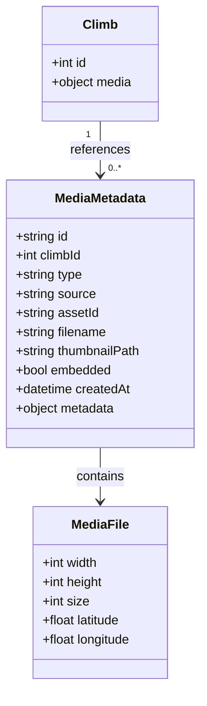
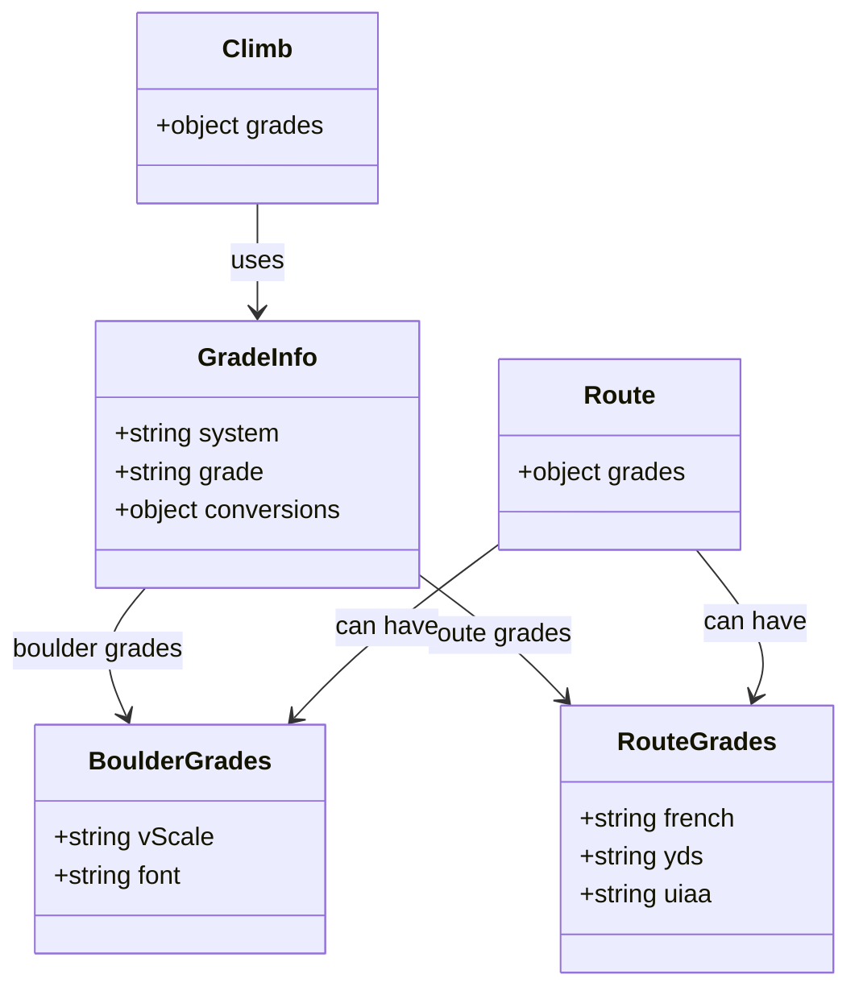
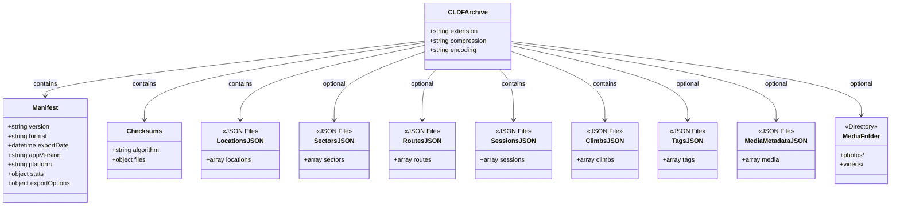

# CrushLog Data Format (CLDF) Specification

Version 1.0.0

## Overview

The CrushLog Data Format (CLDF) is an open, extensible format for exchanging climbing performance data between applications. It provides a comprehensive data model that captures all aspects of climbing activities while maintaining compatibility with other climbing platforms.

## Format Structure

CLDF uses a compressed archive format (`.cldf` extension) containing multiple JSON files. This modular approach allows for:
- Efficient compression and storage
- Partial imports/exports
- Easy versioning and validation
- Human-readable data when extracted

### File Extension
- **Extension**: `.cldf`
- **MIME Type**: `application/x-cldf+zip`
- **Encoding**: UTF-8
- **Compression**: gzip

### Archive Contents

A valid CLDF archive must contain the following files:

```
example.cldf/
├── manifest.json          (required) - Metadata about the export
├── locations.json         (required) - Climbing locations
├── sectors.json          (optional) - Sectors within locations
├── routes.json           (optional) - Route/problem definitions
├── sessions.json         (required) - Climbing sessions
├── climbs.json           (required) - Individual climb records
├── tags.json             (optional) - Custom and predefined tags
├── checksums.json        (required) - SHA-256 hashes for validation
├── media-metadata.json   (optional) - Media file references
└── media/                (optional) - Embedded media files
    ├── photos/
    └── videos/
```

## File Specifications

### manifest.json

Contains metadata about the export, version information, and statistics.

**Required fields:**
- `version` (string): CLDF specification version
- `format` (string): Must be "CLDF"
- `exportDate` (string): ISO 8601 timestamp
- `appVersion` (string): Exporting application version
- `platform` (string): Platform identifier (e.g., "iOS", "Android")

**Optional fields:**
- `stats` (object): Count statistics for exported data
- `exportOptions` (object): Options used during export

[Full schema →](schemas/manifest.schema.json)

### locations.json

Defines climbing locations with geographical and characteristic information.

**Required fields:**
- `id` (integer): Unique identifier
- `name` (string): Location name
- `isIndoor` (boolean): Indoor/outdoor indicator

**Optional fields:**
- `coordinates` (object): GPS coordinates
- `country` (string): Country name
- `state` (string): State/province
- `starred` (boolean): Favorite indicator
- `rockType` (string): Type of rock (enum)
- `terrainType` (string): Terrain classification (enum)

[Full schema →](schemas/locations.schema.json)

### climbs.json

Records individual climb attempts and completions.

**Required fields:**
- `id` (integer): Unique identifier
- `date` (string): Date of climb (YYYY-MM-DD)
- `routeName` (string): Name of route/problem
- `type` (string): "boulder" or "route"
- `finishType` (string): Completion style (enum)

**Optional fields:**
- `sessionId` (string): Reference to session
- `routeId` (string): Reference to route
- `grades` (object): Grade information
- `attempts` (integer): Number of attempts
- `rating` (integer): Quality rating (0-5)
- `notes` (string): Personal notes
- `tags` (array): Associated tags
- `media` (object): Media references

[Full schema →](schemas/climbs.schema.json)

## Data Model

### Class Diagrams

The following diagrams illustrate the structure and relationships between CLDF data types:

#### Core Data Model

```mermaid
classDiagram
    class Location {
        +int id
        +string name
        +float latitude
        +float longitude
        +string country
        +string state
        +bool isIndoor
        +bool starred
        +string rockType
        +string terrainType
        +string accessInfo
        +datetime createdAt
    }
    
    class Sector {
        +int id
        +int locationId
        +string name
        +bool isDefault
        +string description
        +string approach
        +float latitude
        +float longitude
        +datetime createdAt
    }
    
    class Route {
        +int id
        +int locationId
        +int sectorId
        +string name
        +string routeType
        +string routeCharacteristics
        +object grades
        +float height
        +object firstAscent
        +int qualityRating
        +string color
        +string beta
        +string protection
        +datetime createdAt
        +datetime updatedAt
    }
    
    class Session {
        +int id
        +date date
        +time startTime
        +time endTime
        +string location
        +int locationId
        +bool isIndoor
        +string climbType
        +string sessionType
        +array partners
        +object weather
        +string notes
        +string rockType
        +string terrainType
        +int approachTime
        +bool isOngoing
    }
    
    class Climb {
        +int id
        +int sessionId
        +int routeId
        +date date
        +time time
        +string routeName
        +object grades
        +string type
        +string finishType
        +int attempts
        +int repeats
        +bool isRepeat
        +string belayType
        +int duration
        +int falls
        +float height
        +int rating
        +string notes
        +array tags
        +string beta
        +object media
        +string color
        +string rockType
        +string terrainType
        +bool isIndoor
        +array partners
        +string weather
    }
    
    class Tag {
        +int id
        +string name
        +bool isPredefined
        +string predefinedTagKey
        +string color
        +string category
    }
    
    Location "1" --> "0..*" Sector : contains
    Location "1" --> "0..*" Route : has
    Sector "1" --> "0..*" Route : contains
    Location "1" --> "0..*" Session : hosts
    Session "1" --> "0..*" Climb : includes
    Route "1" --> "0..*" Climb : climbed
    Climb "0..*" --> "0..*" Tag : tagged
```



#### Media Model



#### Grade System Model



#### Export Structure



## Data Types and Enums

### Identifiers

All `id` fields in CLDF use integer format for compatibility with SQLite database systems. IDs may be null for new records during import.

### Grade Systems

#### Boulder Grades
- **V-Scale**: `VB`, `V0`-`V17`
- **Fontainebleau**: `3`, `4`, `4+`, `5`, `5+`, `6A`-`9A`

#### Route Grades
- **French**: `3a`-`9c`
- **YDS**: `5.0`-`5.15d`
- **UIAA**: `I`-`XII`

### Enumerations

See [Enumerations Reference](enums.md) for complete enum definitions.

## Media Handling

CLDF supports three media export strategies:

1. **Reference** - Store only media identifiers
2. **Thumbnails** - Include compressed thumbnails
3. **Full** - Embed complete media files

See [Media Specification](media.md) for details.

## Security

### Checksum Verification

All CLDF archives include SHA-256 checksums for data integrity verification.

```json
{
  "algorithm": "SHA-256",
  "files": {
    "manifest.json": "a665a45920422f9d417e4867efdc4fb8...",
    "locations.json": "b3a8e0e1f9ab1bfe3a36f231f676f78b..."
  }
}
```

### Privacy Considerations

- GPS coordinates can be truncated for privacy
- Personal information is not included by default
- Partner names are optional

## Versioning

CLDF follows semantic versioning (MAJOR.MINOR.PATCH):
- **MAJOR**: Incompatible changes
- **MINOR**: Backward-compatible additions
- **PATCH**: Backward-compatible fixes

## Implementation

### Libraries

- **JavaScript/TypeScript**: [cldf-js](https://github.com/cldf/cldf-js)
- **Python**: [cldf-py](https://github.com/cldf/cldf-py)
- **Dart/Flutter**: [cldf-dart](https://github.com/cldf/cldf-dart)

### Tools

- [CLDF Validator](https://cldf.io/validator) - Online validation tool
- [CLDF Converter](https://cldf.io/converter) - Convert between formats

## Examples

See the [examples/](examples/) directory for sample CLDF files.

## Contributing

We welcome contributions! Please see [CONTRIBUTING.md](CONTRIBUTING.md) for guidelines.

## License

The CLDF specification is licensed under [CC BY 4.0](LICENSE).