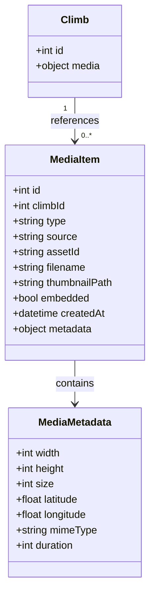
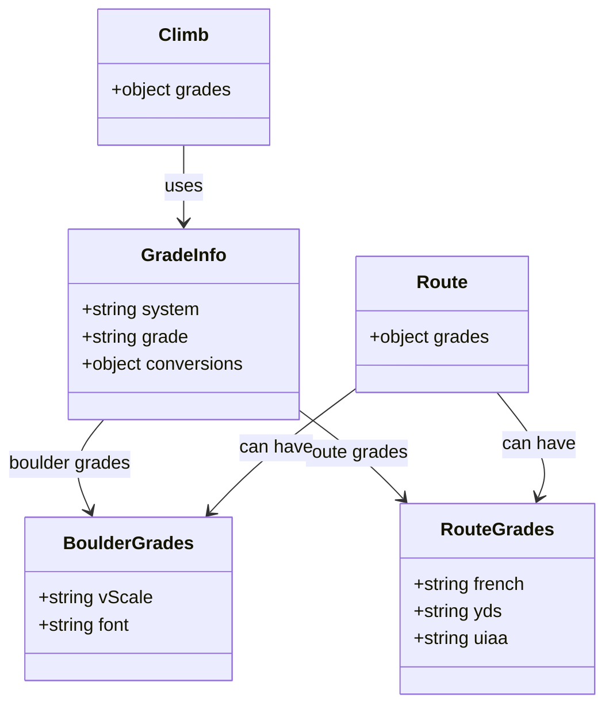
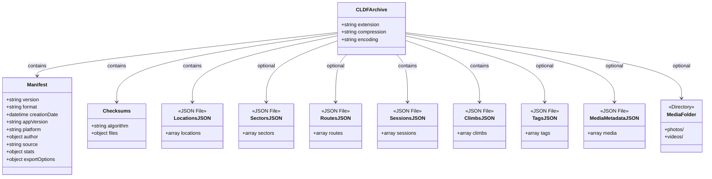

[](https://sonarcloud.io/summary/new_code?id=petrmac_crushlog-data-format-spec)

# CrushLog Data Format (CLDF) Specification

Version 1.0.0

## Overview

The CrushLog Data Format (CLDF) is an open, extensible format for exchanging climbing performance data between applications. It provides a comprehensive data model that captures all aspects of climbing activities while maintaining compatibility with other climbing platforms.

## Quick Start

### Java
```java
// Read CLDF file
CLDFArchive archive = CLDF.read(new File("climbs.cldf"));
archive.getClimbs().forEach(climb -> 
    System.out.println(climb.getRouteName() + " - " + climb.getGrades().getGrade())
);
```

### Dart/Flutter
```dart
// Read CLDF file
final reader = CLDFReader();
final archive = await reader.readFile('climbs.cldf');
for (final climb in archive.climbs ?? []) {
  print('${climb.routeName} - ${climb.grades?.grade}');
}
```

See [Implementation](#implementation) section for installation instructions.

## Format Structure

CLDF uses a compressed archive format (`.cldf` extension) containing multiple JSON files. This modular approach allows for:
- Efficient compression and storage
- Partial imports/exports
- Easy versioning and validation
- Human-readable data when extracted

### File Extension
- **Extension**: `.cldf`
- **MIME Type**: `application/x-cldf+zip`
- **Encoding**: UTF-8
- **Compression**: gzip

### Archive Contents

A valid CLDF archive must contain the following files:

```
example.cldf/
├── manifest.json          (required) - Metadata about the export
├── locations.json         (required) - Climbing locations
├── sectors.json          (optional) - Sectors within locations
├── routes.json           (optional) - Route/problem definitions
├── sessions.json         (required) - Climbing sessions
├── climbs.json           (required) - Individual climb records
├── tags.json             (optional) - Custom and predefined tags
├── checksums.json        (required) - SHA-256 hashes for validation
├── media-metadata.json   (optional) - Media file references
└── media/                (optional) - Embedded media files
    ├── photos/
    └── videos/
```

## File Specifications

### manifest.json

Contains metadata about the export, version information, and statistics.

**Required fields:**
- `version` (string): CLDF specification version (semantic versioning)
- `format` (string): Must be "CLDF"
- `creationDate` (string): ISO 8601 timestamp of export creation
- `appVersion` (string): Exporting application version
- `platform` (string): Platform identifier ("iOS", "Android", "Web", or "Desktop")

**Optional fields:**
- `author` (object): Author information (name, email, website)
- `source` (string): Source application or system that created the export
- `stats` (object): Statistics about exported data
  - `climbsCount` (integer): Number of climbs
  - `sessionsCount` (integer): Number of sessions
  - `locationsCount` (integer): Number of locations
  - `routesCount` (integer): Number of routes
  - `sectorsCount` (integer): Number of sectors
  - `tagsCount` (integer): Number of tags
  - `mediaCount` (integer): Number of media items
- `exportOptions` (object): Options used during export

[Full schema →](schemas/manifest.schema.json)

### locations.json

Defines climbing locations with geographical and characteristic information.

**Required fields:**
- `id` (integer): Unique identifier
- `name` (string): Location name
- `isIndoor` (boolean): Indoor/outdoor indicator

**Optional fields:**
- `coordinates` (object): GPS coordinates
- `country` (string): Country name
- `state` (string): State/province
- `starred` (boolean): Favorite indicator
- `rockType` (string): Type of rock (enum)
- `terrainType` (string): Terrain classification (enum)

[Full schema →](schemas/locations.schema.json)

### sectors.json

Groups routes within a location for better organization.

**Required fields:**
- `id` (integer): Unique identifier
- `locationId` (integer): Reference to parent location
- `name` (string): Sector name

**Optional fields:**
- `description` (string): Sector description
- `order` (integer): Display order
- `coordinates` (object): GPS coordinates

[Full schema →](schemas/sectors.schema.json)

### routes.json

Defines climbing routes or boulder problems.

**Required fields:**
- `id` (integer): Unique identifier
- `locationId` (integer): Reference to location
- `name` (string): Route/problem name
- `routeType` (string): "boulder" or "route"

**Optional fields:**
- `sectorId` (integer): Reference to sector
- `routeCharacteristics` (string): "trad" or "bolted"
- `grades` (object): Grades in different systems
- `height` (number): Height in meters
- `firstAscent` (object): FA information
- `protectionRating` (string): Protection quality (enum)
- `tags` (array): Associated tags

[Full schema →](schemas/routes.schema.json)

### sessions.json

Represents climbing sessions (visits to locations).

**Required fields:**
- `id` (integer): Unique identifier
- `date` (string): Session date (YYYY-MM-DD)
- `location` (string): Location name

**Optional fields:**
- `locationId` (integer): Reference to location ID
- `startTime` (string): Start time (HH:MM:SS)
- `endTime` (string): End time (HH:MM:SS)
- `duration` (integer): Duration in minutes
- `partners` (array): Climbing partners
- `notes` (string): Session notes
- `tags` (array): Associated tags

[Full schema →](schemas/sessions.schema.json)

### climbs.json

Records individual climb attempts and completions.

**Required fields:**
- `id` (integer): Unique identifier
- `date` (string): Date of climb (YYYY-MM-DD)
- `routeName` (string): Name of route/problem
- `type` (string): "boulder" or "route"
- `finishType` (string): Completion style (enum)

**Optional fields:**
- `sessionId` (integer): Reference to session
- `routeId` (integer): Reference to route
- `grades` (object): Grade information
- `attempts` (integer): Number of attempts
- `rating` (integer): Quality rating (0-5)
- `notes` (string): Personal notes
- `tags` (array): Associated tags
- `media` (object): Media references

[Full schema →](schemas/climbs.schema.json)

### tags.json

Defines custom and predefined tags for categorization.

**Required fields:**
- `id` (integer): Unique identifier
- `name` (string): Tag name
- `isPredefined` (boolean): System vs user tag

**Optional fields:**
- `color` (string): Hex color code
- `category` (string): Tag category
- `description` (string): Tag description

[Full schema →](schemas/tags.schema.json)

### media-metadata.json

References to media files (photos/videos).

**Required fields:**
- `id` (integer): Unique identifier
- `climbId` (integer): Reference to climb
- `type` (string): "photo" or "video"

**Optional fields:**
- `source` (string): Source of media ("photos_library", "local", or "embedded")
- `assetId` (string): Platform-specific asset identifier
- `filename` (string): Original filename
- `thumbnailPath` (string): Path to thumbnail within archive
- `embedded` (boolean): Whether full media file is included
- `createdAt` (string): ISO 8601 timestamp
- `metadata` (object): Additional metadata (width, height, size, etc.)

[Full schema →](schemas/media-metadata.schema.json)

## Data Model

### Class Diagrams

The following diagrams illustrate the structure and relationships between CLDF data types:

#### Core Data Model

```mermaid
classDiagram
    class Location {
        +int id
        +string name
        +float latitude
        +float longitude
        +string country
        +string state
        +bool isIndoor
        +bool starred
        +string rockType
        +string terrainType
        +string accessInfo
        +datetime createdAt
    }
    
    class Sector {
        +int id
        +int locationId
        +string name
        +bool isDefault
        +string description
        +string approach
        +float latitude
        +float longitude
        +datetime createdAt
    }
    
    class Route {
        +int id
        +int locationId
        +int sectorId
        +string name
        +string routeType
        +string routeCharacteristics
        +object grades
        +float height
        +object firstAscent
        +int qualityRating
        +string color
        +string beta
        +string protectionRating
        +array tags
        +datetime createdAt
        +datetime updatedAt
    }
    
    class Session {
        +int id
        +date date
        +time startTime
        +time endTime
        +string location
        +int locationId
        +bool isIndoor
        +string climbType
        +string sessionType
        +array partners
        +object weather
        +string notes
        +string rockType
        +string terrainType
        +int approachTime
        +bool isOngoing
    }
    
    class Climb {
        +int id
        +int sessionId
        +int routeId
        +date date
        +time time
        +string routeName
        +object grades
        +string type
        +string finishType
        +int attempts
        +int repeats
        +bool isRepeat
        +string belayType
        +int duration
        +int falls
        +float height
        +int rating
        +string notes
        +array tags
        +string beta
        +object media
        +string color
        +string rockType
        +string terrainType
        +bool isIndoor
        +array partners
        +string weather
    }
    
    class Tag {
        +int id
        +string name
        +bool isPredefined
        +string predefinedTagKey
        +string color
        +string category
    }
    
    class MediaItem {
        +int id
        +int climbId
        +string type
        +string source
        +string assetId
        +string filename
        +string thumbnailPath
        +bool embedded
        +datetime createdAt
        +object metadata
    }
    
    Location "1" --> "0..*" Sector : contains
    Location "1" --> "0..*" Route : has
    Sector "1" --> "0..*" Route : contains
    Location "1" --> "0..*" Session : hosts
    Session "1" --> "0..*" Climb : includes
    Route "1" --> "0..*" Climb : climbed
    Climb "0..*" --> "0..*" Tag : tagged
    Climb "1" --> "0..*" MediaItem : has media
    Route "0..*" --> "0..*" Tag : tagged
```



#### Media Model



#### Grade System Model



#### Export Structure



## Data Types and Enums

### Identifiers

All `id` fields in CLDF use integer format for compatibility with SQLite database systems. IDs may be null for new records during import.

### Grade Systems

#### Boulder Grades
- **V-Scale**: `VB`, `V0`-`V17`
- **Fontainebleau**: `3`, `4`, `4+`, `5`, `5+`, `6A`-`9A`

#### Route Grades
- **French**: `3a`-`9c`
- **YDS**: `5.0`-`5.15d`
- **UIAA**: `I`-`XII`

### Enumerations

See [Enumerations Reference](enums.md) for complete enum definitions.

## Media Handling

CLDF supports comprehensive media file handling for photos and videos associated with climbing sessions. Media items must be associated with specific climbs to maintain context.

### Export Strategies

1. **Reference** - Store only media identifiers and metadata
2. **Thumbnails** - Include compressed thumbnails (future enhancement)
3. **Full** - Embed complete media files in the archive

### Supported Formats

- **Photos**: JPG, JPEG, PNG, GIF, BMP, WebP
- **Videos**: MP4, MOV, AVI, WebM, MKV

### Using Media

```java
// Java - Access embedded media
if (archive.hasEmbeddedMedia()) {
    Map<String, byte[]> mediaFiles = archive.getMediaFiles();
    byte[] photoData = mediaFiles.get("media/photo.jpg");
}
```

```dart
// Dart - Access embedded media
if (archive.hasEmbeddedMedia) {
    final photoBytes = archive.getMediaFile('media/photo.jpg');
}
```

See [Media Support Documentation](MEDIA_SUPPORT.md) for comprehensive details on using media features across all platforms.

## Features

### Automatic Statistics Calculation

Both Java and Dart implementations automatically calculate archive statistics when writing CLDF files. If the manifest doesn't include stats, they will be calculated based on the actual content:

```java
// Java - Stats are calculated automatically
CLDFArchive archive = createArchive();
// No need to set stats manually
CLDF.write(archive, new File("output.cldf"));
```

```dart
// Dart - Stats are calculated automatically
final archive = createArchive();
// No need to set stats manually
await writer.writeFile('output.cldf', archive);
```

The following statistics are automatically calculated:
- `climbsCount`: Number of climbs in the archive
- `sessionsCount`: Number of sessions
- `locationsCount`: Number of locations
- `routesCount`: Number of routes
- `sectorsCount`: Number of sectors
- `tagsCount`: Number of tags
- `mediaCount`: Number of media items

## Security

### Checksum Verification

All CLDF archives include SHA-256 checksums for data integrity verification.

```json
{
  "algorithm": "SHA-256",
  "files": {
    "manifest.json": "a665a45920422f9d417e4867efdc4fb8...",
    "locations.json": "b3a8e0e1f9ab1bfe3a36f231f676f78b..."
  }
}
```

### Privacy Considerations

- GPS coordinates can be truncated for privacy
- Personal information is not included by default
- Partner names are optional

## Versioning

CLDF follows semantic versioning (MAJOR.MINOR.PATCH):
- **MAJOR**: Incompatible changes
- **MINOR**: Backward-compatible additions
- **PATCH**: Backward-compatible fixes

## Implementation

### Client Libraries

#### Java

The Java client library provides full support for reading and writing CLDF archives with both Maven and Gradle support.

**Installation (Maven):**
```xml
<dependency>
    <groupId>io.cldf</groupId>
    <artifactId>cldf-java</artifactId>
    <version>1.2.0</version>
</dependency>
```

**Installation (Gradle):**
```gradle
implementation 'io.cldf:cldf-java:1.2.0'
```

**Quick Example:**
```java
import io.cldf.api.CLDF;
import io.cldf.api.CLDFArchive;

// Read CLDF archive
CLDFArchive archive = CLDF.read(new File("climbing-data.cldf"));
System.out.println("Climbs: " + archive.getClimbs().size());

// Write CLDF archive
CLDF.write(archive, new File("output.cldf"));
```

See the [Java client documentation](clients/java/cldf-java/README.md) for more details.

#### Dart/Flutter

The Dart client library provides type-safe models and full CLDF support for Dart and Flutter applications, including media file handling.

**Installation:**
```yaml
dependencies:
  cldf: ^1.2.0
```

**Quick Example:**
```dart
import 'package:cldf/cldf.dart';

// Read CLDF archive
final reader = CLDFReader();
final archive = await reader.readFile('climbing-data.cldf');
print('Climbs: ${archive.climbs?.length ?? 0}');

// Access embedded media
if (archive.hasEmbeddedMedia) {
  final photoBytes = archive.getMediaFile('media/photo.jpg');
  // Process or save photo bytes
}

// Write CLDF archive
final writer = CLDFWriter();
await writer.writeFile('output.cldf', archive);
```

See the [Dart client documentation](clients/dart/cldf/README.md) for more details.


### Tools

- [CLDF Validator](https://cldf.io/validator) - Online validation tool
- [CLDF Converter](https://cldf.io/converter) - Convert between formats

## Examples

See the [examples/](examples/) directory for sample CLDF files.

## Contributing

We welcome contributions! Please see [CONTRIBUTING.md](CONTRIBUTING.md) for guidelines.

## License

The CLDF specification is licensed under [CC BY 4.0](LICENSE).